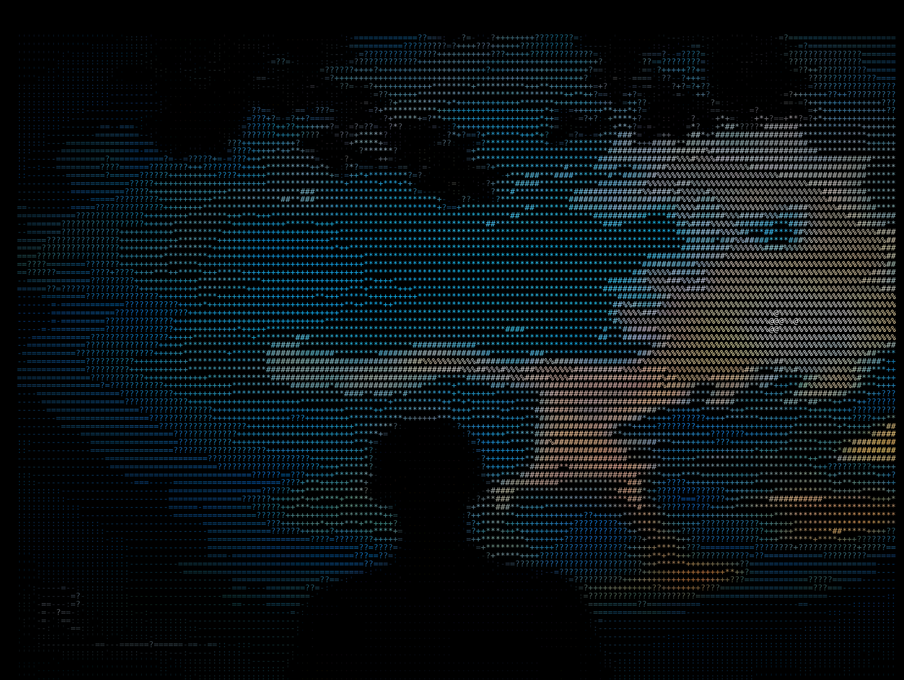
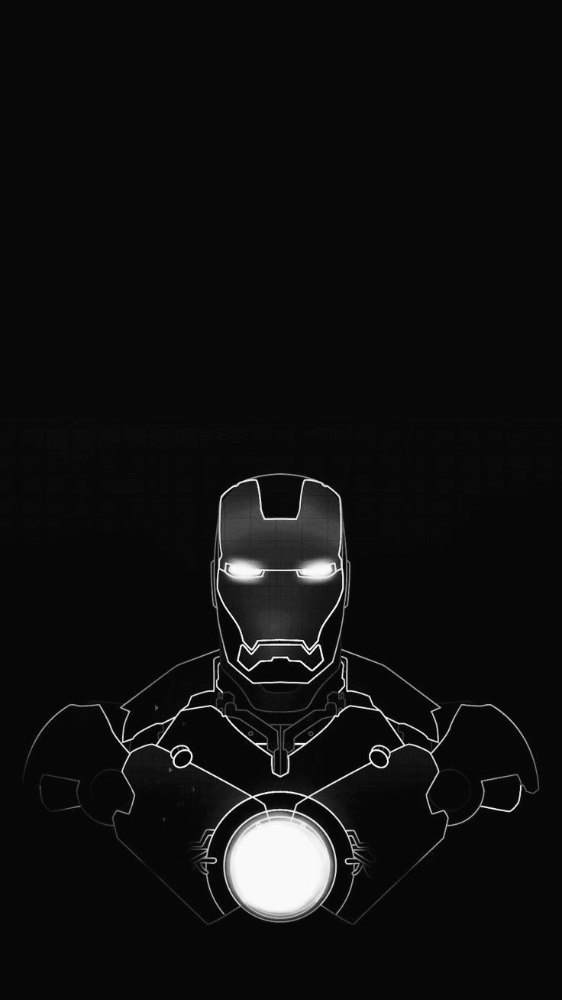
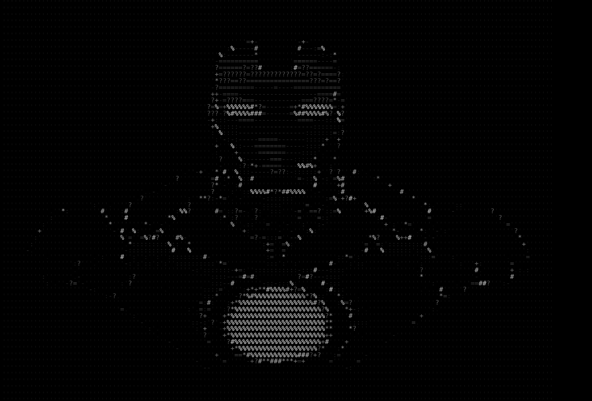
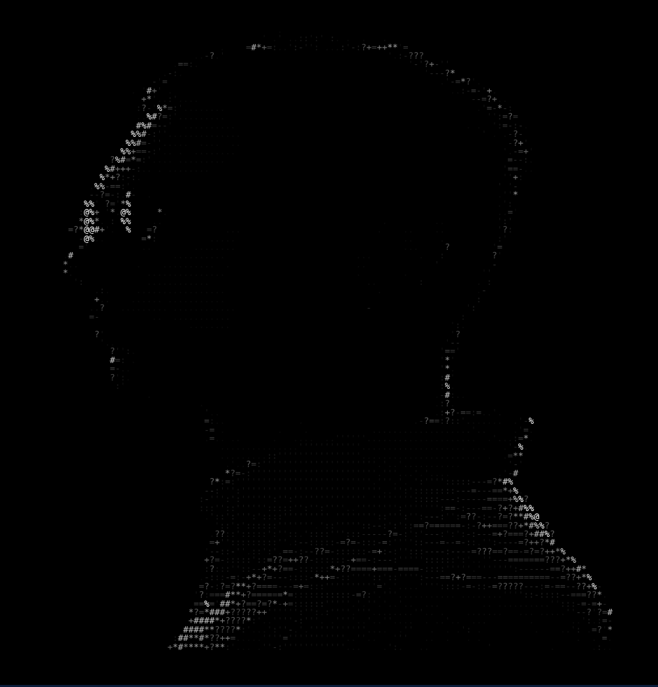
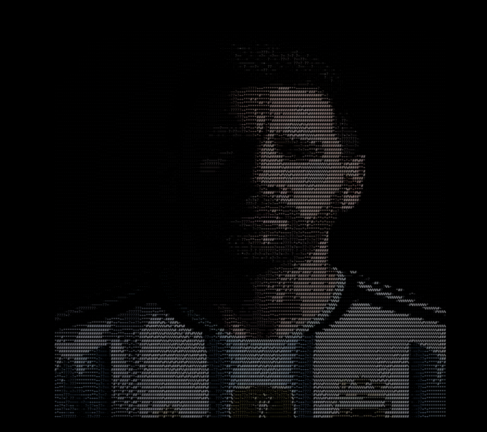

<div align="center">

# 🎨 TerminArt

**Render any image as ASCII art right in your terminal.**

True-color ANSI · plain ASCII · self-contained HTML export

</div>

---

## ✨ Gallery — Source ➜ Terminal Art

Each panel below shows an original photo on the left and the corresponding
TerminArt render on the right. The outputs were generated with the HTML
exporter and captured as PNGs in [`output/`](output).

<br>

<table>
<tr>
<th align="center" width="50%">🖼️ Source</th>
<th align="center" width="6%"></th>
<th align="center" width="50%">🖥️ TerminArt Output</th>
</tr>

<!-- ── Example 1 ───────────────────────────────────────────── -->
<tr><td colspan="3"><br>

### 1 · `dp.jpg`

</td></tr>
<tr>
<td align="center" valign="middle">
  
</td>
<td align="center" valign="middle"><h1>➜</h1></td>
<td align="center" valign="middle">
  
</td>
</tr>

<!-- ── Example 2 ───────────────────────────────────────────── -->
<tr><td colspan="3"><br>

### 2 · `im.jpg`

</td></tr>
<tr>
<td align="center" valign="middle">
  
</td>
<td align="center" valign="middle"><h1>➜</h1></td>
<td align="center" valign="middle">
  
</td>
</tr>

<!-- ── Example 3 ───────────────────────────────────────────── -->
<tr><td colspan="3"><br>

### 3 · `lok.jpg`

</td></tr>
<tr>
<td align="center" valign="middle">
  
</td>
<td align="center" valign="middle"><h1>➜</h1></td>
<td align="center" valign="middle">
  
</td>
</tr>

<!-- ── Example 4 ───────────────────────────────────────────── -->
<tr><td colspan="3"><br>

### 4 · `messi3.jpg`

</td></tr>
<tr>
<td align="center" valign="middle">
  
</td>
<td align="center" valign="middle"><h1>➜</h1></td>
<td align="center" valign="middle">
  
</td>
</tr>

</table>

<br>

> 💡 **Regenerate every panel above** with a single command:
> ```bash
> ./run_all_examples.sh
> ```

---

## 📋 Requirements

- A **C++17** compiler (`g++`)
- **OpenCV 4** development packages (`opencv4`), discoverable via `pkg-config`
  - Debian/Ubuntu: `sudo apt install build-essential pkg-config libopencv-dev`
  - Fedora: `sudo dnf install gcc-c++ pkgconf-pkg-config opencv-devel`

## 🔨 Build

```bash
make
```

This compiles all sources under `src/` and produces the `termart` binary in the
project root. To remove build artifacts:

```bash
make clean
```

## 🚀 Usage

```bash
./termart <image> [options]
```

### Options

| Flag | Description |
| --- | --- |
| `--width N` | Number of character columns (default `100`, allowed `1..500`) |
| `--color truecolor\|none` | `truecolor` (default) emits 24-bit ANSI color; `none` emits plain ASCII |
| `--html` | Write HTML instead of ANSI to the output file |
| `--output FILE` | Output file path (**required** with `--html`) |
| `-h`, `--help` | Show usage and exit |

Default color mode is `truecolor`, so running with no `--color` flag produces
24-bit ANSI output.

## 🧪 Examples

True color (default), 80 columns wide:

```bash
./termart examples/im.jpg --width 80
```

Plain ASCII (no color codes):

```bash
./termart examples/messi3.jpg --width 120 --color none
```

Export a standalone HTML file:

```bash
./termart examples/dp.jpg --html --output output/dp.html
```

There is also a convenience target that runs the default example:

```bash
make run
# equivalent to: ./termart examples/im.jpg --width 100
```

### Batch scripts

| Script | What it does |
| --- | --- |
| [`run_examples.sh`](run_examples.sh) | Renders the four examples to `output/*.html` |
| [`run_all_examples.sh`](run_all_examples.sh) | Checks for OpenCV, rebuilds, then renders all examples |

## 🔍 What to Expect

- **truecolor (default):** the image is printed as ASCII characters where each
  character is wrapped in a 24-bit ANSI foreground color escape
  (`ESC[38;2;R;G;Bm ... ESC[0m`). On a modern terminal this shows a full-color
  ASCII rendering. When piped to a file or a non-color terminal the escape
  sequences are still present.
- **`--color none`:** the same ASCII glyphs with no escape sequences — safe for
  plain-text logs and diffs.
- **`--html --output FILE`:** nothing is printed to the terminal; instead a
  complete HTML document is written to `FILE` (a `<pre>` of colorized spans on a
  black background). Open it in a browser to view the artwork.
- **Errors:** a missing/unreadable image or a bad flag prints
  `error: <message>` to stderr and exits with status `1`. A successful run exits
  with status `0`.

---

<div align="center">
<sub>Built with C++17 &amp; OpenCV · ASCII art for your terminal</sub>
</div>
